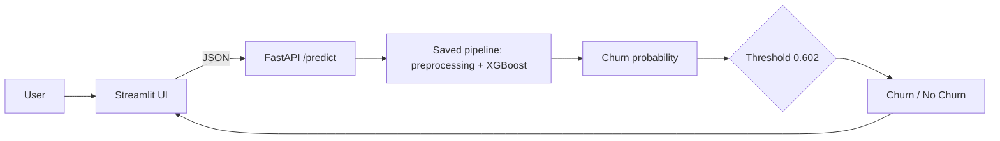

# Telco Customer Churn Prediction
End-to-end machine learning project: exploratory analysis, model comparison, a tuned XGBoost classifier with a business-driven decision threshold, SHAP explanations, and a tested **FastAPI + Streamlit** app packaged with **Docker**.

## Problem
A telecom company loses revenue every time a customer leaves, and keeping a customer is usually cheaper than winning a new one. This project predicts **which customers are likely to churn** and **why**, so a retention team can target offers where they matter most.
- **Data:** IBM Telco Customer Churn sample dataset, 7,043 customers and 21 columns (demographics, services, contract, billing). About 26% of customers churned.
- **Task:** binary classification (churn = Yes / No) on an imbalanced target.
- **Evaluation:** ROC-AUC, plus precision, recall and F1 for the churn class. Accuracy is not used as the main metric, because predicting "no churn" for everyone already scores about 73%.

## Results
All models share the same stratified 80/20 split (5,634 train / 1,409 test, `random_state=42`) and the same preprocessing. Hyperparameters were tuned with 5-fold stratified cross-validation on the **training set only**, and the test set was used once for the final numbers.

| Model | CV ROC-AUC | Test ROC-AUC | Churn precision | Churn recall | Churn F1 |
|---|---|---|---|---|---|
| Logistic Regression | 0.8448 | 0.8408 | 0.50 | 0.78 | 0.61 |
| Random Forest | 0.8483 | 0.8417 | 0.54 | 0.77 | 0.63 |
| **XGBoost** (threshold 0.602) | **0.8502** | **0.8475** | **0.58** | **0.73** | **0.64** |

**How to read this honestly:**
- The three models are close. The ROC-AUC gaps are smaller than the fold-to-fold spread (about ±0.009), so the data mostly rewards simple, regularized models. XGBoost was chosen because it had the best cross-validated score, and its tuned parameters (shallow trees, low learning rate, heavy regularization) show it was kept simple.
- Logistic Regression and Random Forest rows use the default 0.5 threshold, while XGBoost uses a tuned one. Part of its precision and F1 advantage comes from the threshold, so **ROC-AUC is the fair, threshold-free comparison**.

**Final model on the held-out test set** (1,409 customers):
| | Predicted: No churn | Predicted: Churn |
|---|---|---|
| **Actual: No churn** | 834 | 201 |
| **Actual: Churn** | 102 | 272 |

Accuracy 0.785, precision 0.575, recall 0.727, F1 0.642, ROC-AUC 0.8475. The model catches about 73% of churners and flags about 1 in 3 customers.

### Decision threshold
The default 0.5 cutoff is a choice, not a rule. The threshold (**0.602**) was picked as the best-F1 point on out-of-fold predictions from the training set, so the test set stayed untouched. Lower thresholds catch more churners at the cost of more wasted offers, and higher ones do the reverse. If the real cost of a retention offer versus a lost customer is known, the threshold should be chosen from that ratio instead.

## What drives churn (SHAP)


Factors most associated with higher churn risk:
1. **Month-to-month contracts**, the strongest single driver. Two-year contracts protect against churn.
2. **Short tenure.** New customers are the most likely to leave.
3. **No online security and no tech support.**
4. **Fiber optic internet** and **higher monthly charges.**
5. **Paying by electronic check.**

Suggested actions: move month-to-month customers to longer contracts, invest in first-year onboarding, bundle security and support add-ons, review fiber pricing and service quality, and encourage automatic payments.
> SHAP shows what the model relies on, not what causes churn. These actions should be validated with A/B tests before rollout.

## Architecture

- **Pipeline:** one scikit-learn `Pipeline` holds imputation, scaling, one-hot encoding and the XGBoost model, so prediction applies exactly the same transformations as training.
- **Artifact:** `model/churn_xgb.joblib` stores the pipeline, the threshold, the column list, valid category values, test metrics and library versions.
- **API:** `POST /predict` validates input with Pydantic (typos like `"month to month"` return a 422 instead of being silently mis-encoded), estimates `TotalCharges` as tenure × monthly charges when it is omitted, and returns the probability, the label and the threshold. `GET /health` is available for monitoring.
- **UI:** a Streamlit form that calls the API. It locks add-on fields to "No internet service" when internet is "No", which avoids combinations that never occur in real data.
- **Docker:** two images (API and UI) started together with Docker Compose, with library versions pinned to those used for training.

## Data preparation
- `TotalCharges` had 11 blank values, all for customers with tenure 0 (not yet billed). They were set to 0.
- `customerID` was dropped.
- Numeric features (`tenure`, `MonthlyCharges`, `TotalCharges`) are median-imputed and standardized. Categorical features are mode-imputed and one-hot encoded, giving 46 model features.
- Class imbalance is handled with `scale_pos_weight` (about 2.8) for XGBoost and `class_weight="balanced"` for the other models.

## Run it

### With Docker (recommended)
```bash
git clone https://github.com/<your-username>/telco-churn-prediction.git
cd telco-churn-prediction
docker compose up -d --build
```
| What | URL |
|---|---|
| UI | http://localhost:9124 |
| API docs | http://localhost:9123/docs |
| Health check | http://localhost:9123/health |

Stop with `docker compose down`. More detail, including running without Docker and troubleshooting, is in [RUN_LOCALLY.md](RUN_LOCALLY.md).

### Retrain the model
```bash
python -m venv .venv
.venv\Scripts\activate            # Windows (use source .venv/bin/activate on macOS/Linux)
pip install -r requirements-api.txt -r requirements-ui.txt pytest httpx

python -m src.train               # trains, picks the threshold, evaluates, saves the model
python -m src.predict             # sanity checks on the saved model
python -m pytest tests -v         # API tests
```
Rebuild the Docker images after retraining so the new model file is copied in.

### Example request
```bash
curl -X POST http://localhost:9123/predict -H "Content-Type: application/json" -d '{
  "gender": "Female", "SeniorCitizen": 0, "Partner": "No", "Dependents": "No",
  "tenure": 2, "PhoneService": "Yes", "MultipleLines": "No",
  "InternetService": "Fiber optic", "OnlineSecurity": "No", "OnlineBackup": "No",
  "DeviceProtection": "No", "TechSupport": "No", "StreamingTV": "No",
  "StreamingMovies": "No", "Contract": "Month-to-month",
  "PaperlessBilling": "Yes", "PaymentMethod": "Electronic check",
  "MonthlyCharges": 70.7
}'
```

Response:
```json
{
  "churn_probability": 0.0,
  "prediction": "Churn",
  "threshold": 0.602,
  "total_charges_estimated": true
}
```
(The probability shown is a placeholder. Run the request to see the real value.)

## Project structure
```
.
├── data/
│   ├── raw/                     original dataset
│   └── telco_clean.csv          cleaned data used for modeling
├── notebooks/
│   ├── 01_eda_preprocessing.ipynb
│   ├── 02_model_comparison.ipynb
│   └── 03_xgboost_threshold_shap.ipynb
├── src/
│   ├── preprocessing.py         loading, split, preprocessing pipeline
│   ├── train.py                 training, threshold selection, evaluation, saving
│   └── predict.py               load model and predict one customer
├── app/main.py                  FastAPI service
├── ui/streamlit_app.py          Streamlit front end
├── tests/test_api.py            7 pytest tests
├── model/churn_xgb.joblib       saved pipeline + threshold + metadata
├── Dockerfile / Dockerfile.ui / docker-compose.yml
├── requirements-api.txt / requirements-ui.txt
└── RUN_LOCALLY.md
```

## Tech stack
Python 3.13, pandas, NumPy, scikit-learn, XGBoost, SHAP, FastAPI, Pydantic, Uvicorn, Streamlit, pytest, Docker and Docker Compose.

## Limitations and next steps
- **Precision is about 58%.** Roughly four in ten flagged customers would not have left, so the cost of a retention offer matters when choosing the threshold.
- **Association, not causation.** Interventions suggested by SHAP need A/B testing.
- **Single dataset.** It is a sample dataset, so real-world performance would need monitoring for drift and periodic retraining.
- **Feature engineering was not explored.** Ideas include service counts, average monthly spend and tenure groups, to be judged by cross-validation only.
- **API checks fields independently.** It does not yet reject contradictory combinations such as no internet service with online security "Yes".
- **No authentication or cloud deployment.** The app is containerized and ready to deploy (for example to a container service), but the demo runs locally.

## Author

**Your Name**
[LinkedIn](https://www.linkedin.com/in/deepanjali-singh-4b4749221/?isSelfProfile=true) · [GitHub](https://github.com/DEEPANJALI-11) ·deepanjalisingh089@gail.com

## License


## Acknowledgements
Dataset: IBM Telco Customer Churn sample data, also available on Kaggle.
